# Palmoria Group HR Analysis

This project analyzes HR data for Palmoria Group (943 employees) to provide insights into demographics, pay equity, and performance, using `Excel` and `Power BI`.

## Methodology

-**Data Cleaning:** (Used `Excel` to remove blanks, standardize `Gender` with `TRIM`, and convert text to numeric data)
- Removed 4 duplicates (943 rows remain).
- Replaced 43 blank `Gender` with "Non-Disclosed" (fixed `(blank)` with `TRIM`).
- Removed 28 `NULL` `Department` and 43 blank `Salary` rows.
- Handled 71 "Not Rated" records (~7.5%) by assigning 0% bonus ("No Bonus").
- Fixed `Bonus Amount` formatting to show "$0.00" for "No Bonus" rows (Currency format).
- Converted `Salary` from text to numeric to fix `Meets_Minimum` (e.g., $37,800 identified).

**Analysis:** (Calculated pay gaps and departmental metrics using pivot tables and `Power BI` measures)

### 1. Gender Distribution
- **Organization-wide**:
  - Male: 464 (49.20%)
  - Female: 440 (46.66%)
  - Non-Disclosed: 39 (4.14%)
    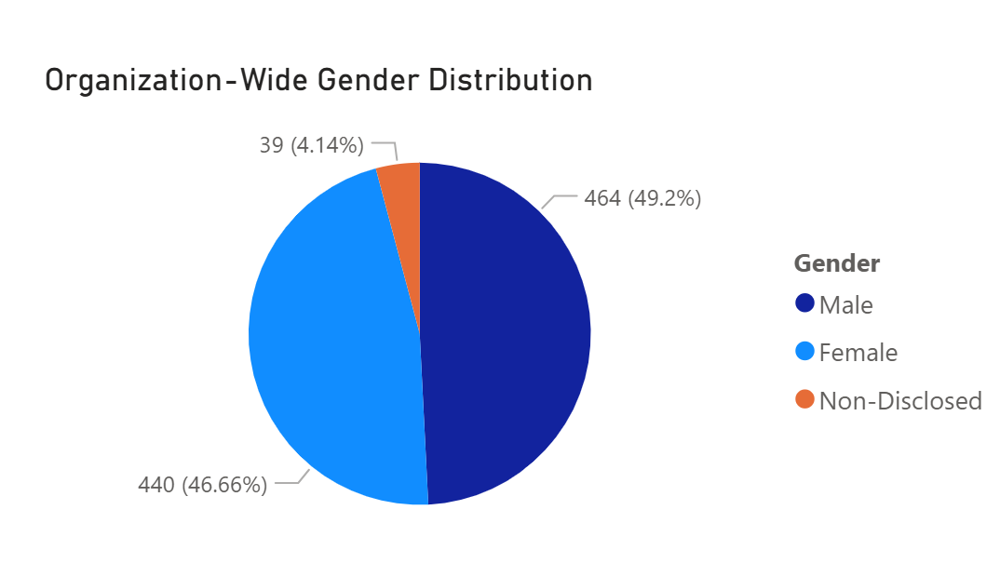
- **By Region**:
  - Abuja (333): Female: 158 (47.4%), Male: 158 (47.4%), Non-Disclosed: 17 (5.1%)
  - Kaduna (360): Female: 164 (45.6%), Male: 182 (50.6%), Non-Disclosed: 14 (3.9%)
  - Lagos (250): Female: 118 (47.2%), Male: 124 (49.6%), Non-Disclosed: 8 (3.2%)
    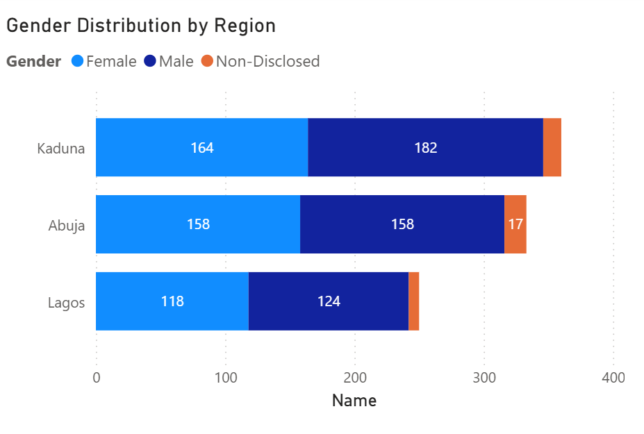
- **By Department**:
  - Accounting (67): Female: 28 (41.8%), Male: 37 (55.2%), Non-Disclosed: 2 (3.0%)
  - Business Development (81): Female: 41 (50.6%), Male: 37 (45.7%), Non-Disclosed: 3 (3.7%)
  - Engineering (79): Female: 38 (48.1%), Male: 36 (45.6%), Non-Disclosed: 5 (6.3%)
  - Human Resources (82): Female: 41 (50.0%), Male: 38 (46.3%), Non-Disclosed: 3 (3.7%)
  - Legal (88): Female: 34 (38.6%), Male: 49 (55.7%), Non-Disclosed: 5 (5.7%)
  - Marketing (65): Female: 31 (47.7%), Male: 33 (50.8%), Non-Disclosed: 1 (1.5%)
  - Product Management (89): Female: 41 (46.1%), Male: 47 (52.8%), Non-Disclosed: 1 (1.1%)
  - Research and Development (74): Female: 38 (51.4%), Male: 31 (41.9%), Non-Disclosed: 5 (6.8%)
  - Sales (80): Female: 36 (45.0%), Male: 40 (50.0%), Non-Disclosed: 4 (5.0%)
  - Services (82): Female: 42 (51.2%), Male: 37 (45.1%), Non-Disclosed: 3 (3.7%)
  - Support (80): Female: 34 (42.5%), Male: 42 (52.5%), Non-Disclosed: 4 (5.0%)
  - Training (76): Female: 36 (47.4%), Male: 37 (48.7%), Non-Disclosed: 3 (3.9%)
     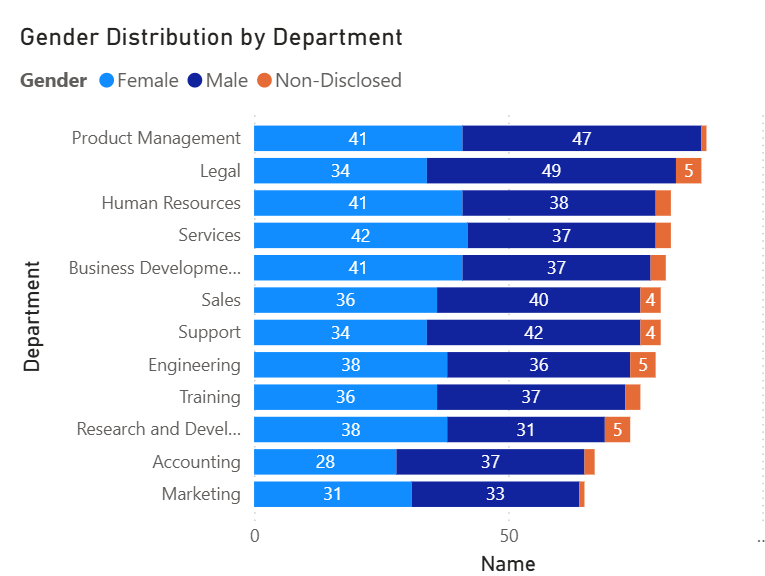

### 2. Ratings by Gender
- **Female** (440):
  - Average: 189 (43.0%)
  - Good: 89 (20.2%)
  - No Bonus (Not Rated): 35 (8.0%)
  - Poor: 58 (13.2%)
  - Very Good: 49 (11.1%)
  - Very Poor: 20 (4.5%)
- **Male** (446):
  - Average: 212 (47.5%)
  - Good: 81 (18.2%)
  - No Bonus (Not Rated): 34 (7.6%)
  - Poor: 70 (15.7%)
  - Very Good: 36 (8.1%)
  - Very Poor: 31 (7.0%)
- **Non-Disclosed** (39):
  - Average: 18 (46.2%)
  - Good: 8 (20.5%)
  - No Bonus (Not Rated): 2 (5.1%)
  - Poor: 3 (7.7%)
  - Very Good: 5 (12.8%)
  - Very Poor: 3 (7.7%)
- Note: Non-Disclosed has lower No Bonus (5.1%) than Female (8.0%) and Male (7.6%), suggesting no bias in missing ratings. Females have higher Very Good ratings (11.1%) than Males (8.1%).
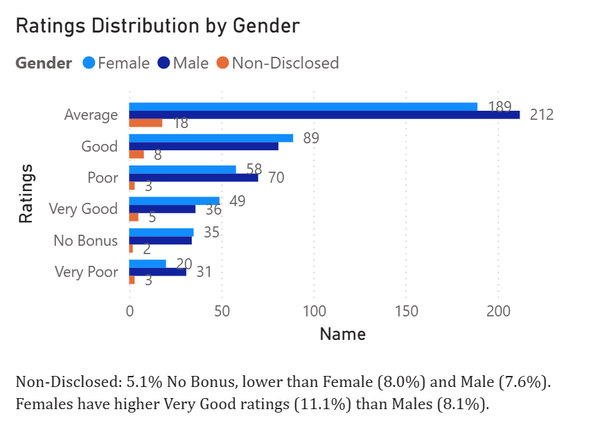

### 3. Salary Structure and Gender Pay Gap
- **Overall**:
  - Male: $74,834.61
  - Female: $72,165.68
  - Non-Disclosed: $78,658.72
  - Pay Gap (Male vs. Female): 3.57%
    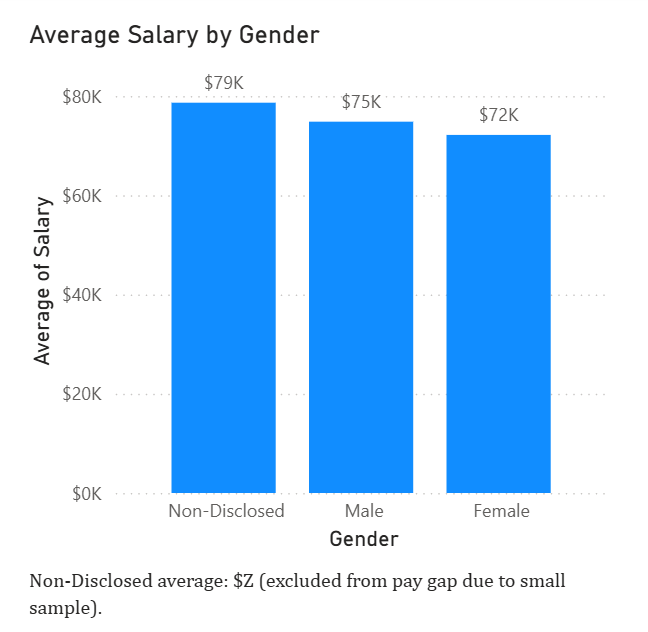
- **By Department**:
  - Business Development: Female: $74,627.80, Male: $82,016.49, Gap: 9.01%
  - Engineering: Female: $75,422.11, Male: $67,916.94, Gap: -11.05% (Female earns more)
  - Human Resources: Female: $66,578.78, Male: $73,796.05, Gap: 9.78%
  - Legal: Female: $68,506.76, Male: $72,997.96, Gap: 6.15%
  - Marketing: Female: $79,107.74, Male: $73,701.82, Gap: -7.33% (Female earns more)
  - Product Management: Female: $70,773.17, Male: $76,100.85, Gap: 7.00%
  - Research and Development: Female: $66,603.95, Male: $69,062.58, Gap: 3.56%
  - Sales: Female: $70,406.67, Male: $72,039.75, Gap: 2.27%
  - Services: Female: $73,075.48, Male: $79,456.22, Gap: 8.03%
  - Support: Female: $72,415.00, Male: $77,414.52, Gap: 6.46%
  - Training: Female: $77,082.22, Male: $74,896.22, Gap: -2.92% (Female earns more)
    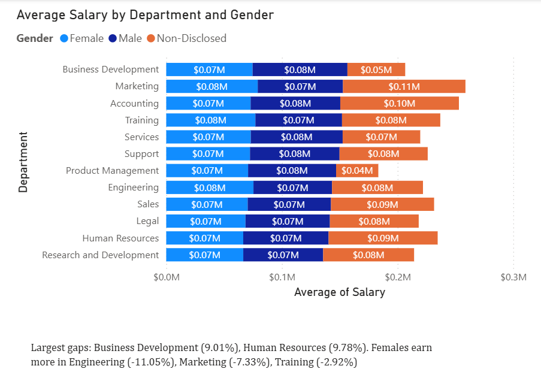
- **By Region**:
  - Abuja: Female: $70,452.03, Male: $73,368.16, Gap: 3.97%
  - Kaduna: Female: $72,379.21, Male: $74,849.95, Gap: 3.30%
  - Lagos: Female: $74,163.47, Male: $76,680.65, Gap: 3.28%
- Note: Non-Disclosed (4.14%) excluded from pay gap calculations due to small sample size.
  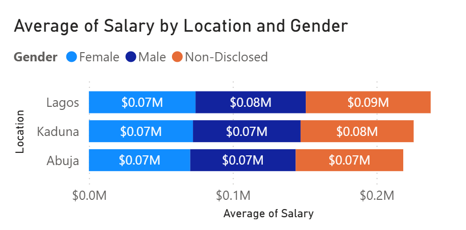

### 4. Minimum Salary and Pay Distribution
- **$90,000 Minimum**:
  - Below $90,000: 651 (69.03%), including $37,800.
  - At or Above $90,000: 292 (30.97%).
    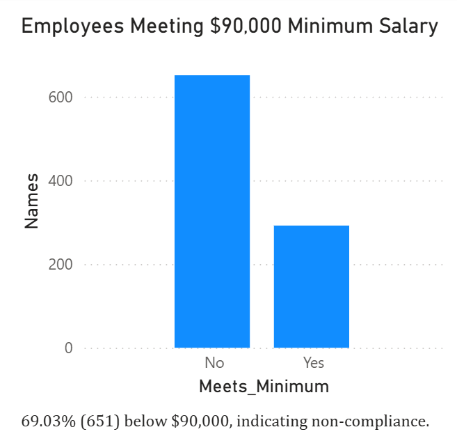
- **Pay Bands**:
  - 20,000–29,999: 26
  - 30,000–39,999: 103
  - 40,000–49,999: 105
  - 50,000–59,999: 94
  - 60,000–69,999: 98
  - 70,000–79,999: 117
  - 80,000–89,999: 108
  - 90,000–99,999: 90
  - 100,000–109,999: 105
  - 110,000–119,999: 97
    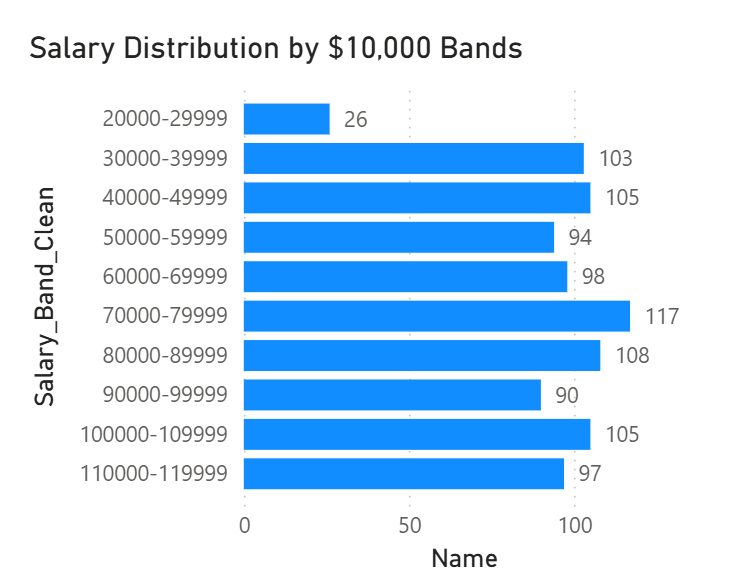
- **By Region**:
  - Abuja (333):
    - 20,000–29,999: 9
    - 30,000–39,999: 37
    - 40,000–49,999: 45
    - 50,000–59,999: 36
    - 60,000–69,999: 35
    - 70,000–79,999: 35
    - 80,000–89,999: 39
    - 90,000–99,999: 29
    - 100,000–109,999: 39
    - 110,000–119,999: 29
  - Kaduna (360):
    - 20,000–29,999: 11
    - 30,000–39,999: 41
    - 40,000–49,999: 33
    - 50,000–59,999: 40
    - 60,000–69,999: 37
    - 70,000–79,999: 48
    - 80,000–89,999: 39
    - 90,000–99,999: 32
    - 100,000–109,999: 41
    - 110,000–119,999: 38
  - Lagos (250):
    - 20,000–29,999: 6
    - 30,000–39,999: 25
    - 40,000–49,999: 27
    - 50,000–59,999: 18
    - 60,000–69,999: 26
    - 70,000–79,999: 34
    - 80,000–89,999: 30
    - 90,000–99,999: 29
    - 100,000–109,999: 25
    - 110,000–119,999: 30
- Note: Kaduna has the most employees (360) and highest count in $70,000–$79,999 (48). Abuja has the most in $40,000–$49,999 (45). Lagos has fewer low-band employees (e.g., 20,000–29,999: 6).
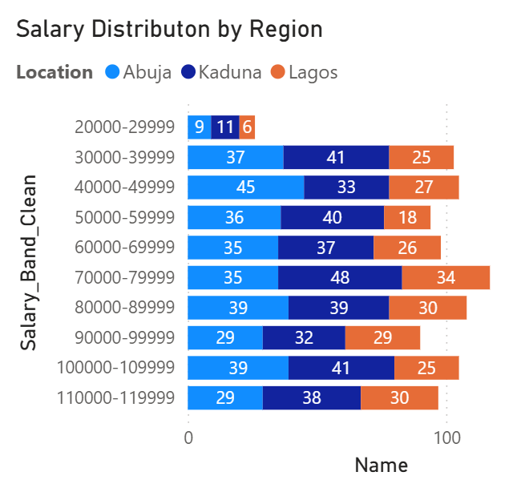

### 5. Bonus Calculations
- **Individual Bonuses**: Calculated using `Bonus Rules` (e.g., Sales, Good = 5.10%, Not Rated = 0%).
- **Total Compensation**: Salary + Bonus, verified after fixing `Salary`.
- **By Region**:
  - Abuja: $24,790,484.45
  - Kaduna: $27,418,141.46
  - Lagos: $19,526,793.31
    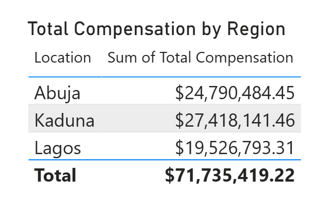
- **Company-wide**: $71,735,419.22
- Note: Kaduna has the highest total compensation ($27.4M) due to the most employees (360). Lagos has the lowest ($19.5M) with 250 employees.
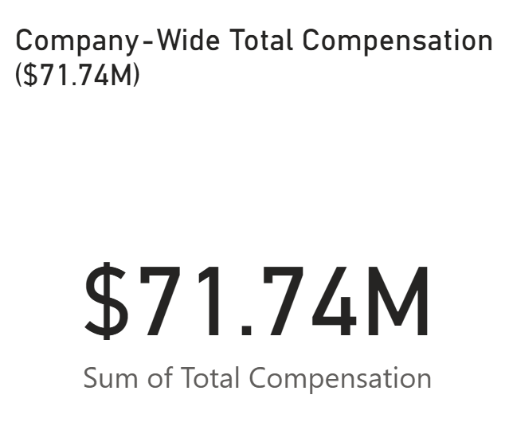

## Recommendations
- Address pay gaps in Business Development (9.01%), Human Resources (9.78%), and Services (8.03%).
- Adjust salaries for 651 employees (69.03%) below $90,000 to ensure compliance (e.g., $37,800 identified).
- Investigate 71 "Not Rated" employees (~7.5%) for performance review gaps.
- Monitor Non-Disclosed gender (4.14%) for fairness in ratings and pay, though excluded from pay gap analysis.

## Repository
- [Link to GitHub repository]
  
## Files
- [Excel Dataset](Cleaned_Palmoria_Group.xlsx)
- [Power BI File](Palmoria_HR_Analysis.pbix)

This project showcases my expertise in HR analytics, data visualization, and actionable reporting for business decisions.
